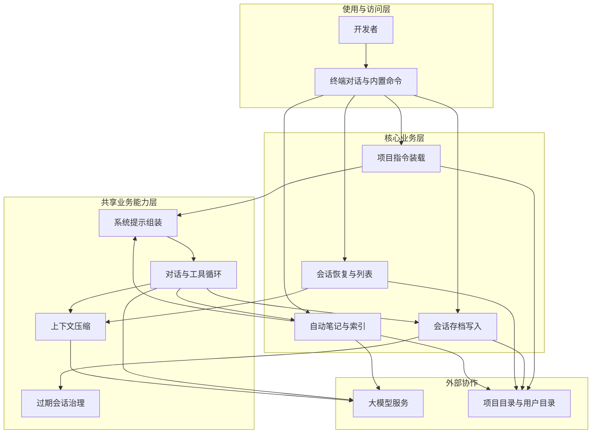

# 项目记忆与会话持久化 产品概要说明书

> 版本：v1.0 · 状态：草稿 · 适用迭代：ch09 项目记忆与会话持久化
>
> 关联文档：本说明书承接 ch08「单进程内长时间工作不崩」能力；明确不包含向量检索、RAG、团队记忆同步、启动自动恢复最近会话等（见第九章）
>
> 路径约定：全文统一使用 `.lavendercode`（与现有工程及 Spec F1/F25 一致）。原文中偶现的 `.lavender` 视为笔误，以本说明书为准。

---

## 一、概述

### 1.1 背景与现状

#### 业务场景

- **使用主体**：在本地项目中使用 LavenderCode 终端 Agent 的开发者。
- **核心诉求**：反复回到同一项目时，Agent 应已知编码规范、个人偏好与未完成工作，无需每次从头解释。
- **现有方案及局限**：ch08 解决了「单进程内长时间工作不崩」；进程退出后对话历史与工作上下文全部丢失。系统当前基本是无状态的——每次启动都是全新会话。

#### 现状的核心问题

1. **跨进程失忆**：进程退出后工作记忆清零，无法接着上次进度继续。
2. **项目约定靠口头重述**：技术栈、代码规范、注意事项缺少稳定注入入口，易遗漏。
3. **偏好与纠正不沉淀**：用户反复纠正的习惯不会自动变成可复用的长期记忆。
4. **无主动续聊入口**：缺少从历史会话列表中选择恢复的交互。
5. **存档无治理**：会话目录若无限堆积，磁盘与列表噪音持续增长。

#### 解决方案目标

以三套互相独立、协同作战的机制补齐「跨会话记忆」：

1. **项目指令文件（静态规范）**：手写 Markdown（`LAVENDERCODE.md`），三层优先级合并后注入系统提示，首轮即遵循项目约定。
2. **会话存档（工作记忆）**：对话以 JSONL 实时追加落盘；用户通过 `/resume` 从历史列表恢复；崩溃最多丢最后一行。
3. **自动笔记（演化的长期记忆）**：满足触发条件时异步提炼并分类持久化，后续会话通过记忆索引自动注入。

### 1.2 产品目标

- **G1**：新会话启动时自动加载项目指令和记忆索引，Agent 从第一轮就能遵循项目规范、了解用户偏好。
- **G2**：对话历史以 JSONL 追加写入磁盘，崩溃最多丢最后一行；恢复时能处理坏行、孤立工具调用、token 超限等异常。
- **G3**：用户可通过 `/resume` 从历史会话列表选择恢复，支持上下键选择与搜索过滤。
- **G4**：满足触发条件后自动提取值得记住的信息，分类存为持久化笔记，无需用户手动管理。
- **G5**：项目指令支持 `@include`，具备嵌套深度限制与环路检测，防止加载失控。
- **G6**：对现有 Agent 主循环影响最小：指令与记忆在请求组装阶段注入；笔记更新异步、不阻塞交互。
- **G7**：过期会话（30 天以上）在启动时自动清理，防止磁盘无限增长。
- **G8**：session ID 统一为 `YYYYMMDD-HHMMSS-xxxx`，同时覆盖工具结果落盘目录与 JSONL 存档。

### 1.3 术语表

| 术语 | 含义 |
| :--- | :--- |
| 项目指令文件 | 名为 `LAVENDERCODE.md` 的 Markdown；记录技术栈、代码规范、注意事项等静态约定 |
| 指令三层优先级 | ① 项目根 `LAVENDERCODE.md`（最高）→ ② 项目配置级 `.lavendercode/LAVENDERCODE.md` → ③ 用户级 `~/.lavendercode/LAVENDERCODE.md`（最低）；高优先级内容排在前面 |
| `@include` | 独占一行的引用语法：`@include <relative_path>`；展开为被引用文件全文；有深度、环路、路径边界约束 |
| 根边界 | 项目级指令展开不得跳出 `<project_root>`；用户级不得跳出 `~/.lavendercode/` |
| 会话存档 | 每个会话目录下的 `conversation.jsonl`；一行一条消息或压缩标记 |
| 压缩标记行 | `type=compact` 的 JSONL 行；恢复时从最后一个 compact 之后加载 |
| 工作记忆 | 当前/已恢复会话内的消息与工具交互上下文 |
| 长期记忆 / 自动笔记 | 跨会话复用的分类笔记（偏好、纠正、项目知识、参考资料） |
| 记忆索引 | 各级 `MEMORY.md`；注入上下文的是索引摘要而非笔记全文 |
| 自然停轮 / Done | Agent 完整执行结束且最终回复无工具调用 |
| `/resume` | 内置命令：在空闲态打开历史会话选择列表并执行恢复 |
| 时间跨度提醒 | 恢复时若末条消息距今超过 6 小时，追加一条系统风格的用户消息提醒上下文可能过时 |
| Session ID | 格式 `YYYYMMDD-HHMMSS-xxxx`（本地启动时刻 + 4 位十六进制防撞） |

---

## 二、角色与权限

### 2.1 角色定义

| 角色 | 职责描述 | 主要使用方式（业务入口） |
| :--- | :--- | :--- |
| 开发者 | 编写/维护指令文件；日常对话；通过 `/resume` 续聊；间接受益于自动笔记 | 终端对话；编辑 `LAVENDERCODE.md` 与 memory 目录文件 |
| Agent | 按指令与记忆索引行事；停轮后按规则异步更新笔记；会话追加与恢复由系统配合完成 | 随用户消息与工具循环自动运行 |
| 本机治理（同开发者） | 依赖启动时自动清理过期会话；可手工管理笔记与存档 | 启动流程后台清理；本地文件管理 |

> 首期单机个人场景，不设多租户；团队记忆同步不在范围。

### 2.2 权限矩阵

| 操作 | 开发者 | Agent / 系统 | 说明 |
| :--- | :--- | :--- | :--- |
| 编辑三层指令文件 | ✓ | - | 用户手写维护 |
| 启动时装载指令与记忆索引 | - | ✓（自动，一次缓存） | 进程内不变；本章不做热更新 |
| `/resume` 选择并恢复会话 | ✓（仅空闲态） | 系统执行恢复流水线 | 与 Agent 运行互斥 |
| JSONL 追加 / 刷盘 | - | ✓（自动） | 失败记日志，不中断对话 |
| 过期会话清理 | - | ✓（启动后台） | 仅新格式 ID；失败单目录跳过 |
| 触发记忆更新 | 条件（含关键词） | ✓（每 5 轮或关键词） | 异步；失败静默 |
| 跨根边界 `@include` | - | 拦截 | 追加警告注释，不加载 |
| 旧格式会话展示/清理 | - | - | 列表不展示；也不自动清理 |

---

## 三、系统的整体架构与主流程

> 从业务与能力角度描述构成与闭环；不描述部署拓扑与源码结构。类名/包名仅在附录能力对照中出现（便于与 Spec 对齐），正文以能力域表述。

### 3.1 系统总体架构

**架构说明：**

| 序号 | 图中位置 | 填写要求 |
| :--- | :--- | :--- |
| 1 | 使用与访问层 | 开发者通过终端对话与 `/resume` 等内置命令使用；无独立 Web 管理端 |
| 2 | 核心业务层 | **指令装载**：三层扫描、@include 安全展开、注入 custom-instructions；**会话存档**：JSONL 追加与压缩标记；**会话恢复**：列表、过滤、异常降级恢复；**自动笔记**：分级存储、索引维护、条件触发更新 |
| 3 | 共享业务能力层 | 系统提示组装（指令 + 记忆模块槽位）；主循环；压缩（含恢复超限时先压一次）；启动时过期清理 |
| 4 | 外部协作层 | 大模型：主对话、压缩、记忆更新；本地文件系统：指令、会话目录、memory 目录 |

### 3.2 系统级主流程（端到端）

1. **[阶段一 · 启动]**：开发者启动进程 → 系统加载并缓存项目指令 → 初始化记忆并加载索引 → 后台清理超过 30 天的新格式会话目录 → 将指令文本与记忆文本交给对话入口用于系统提示组装 → **始终开新会话**（不自动恢复最近会话）。
2. **[阶段二 · 日常协作]**：用户发消息 → Agent 在指令与记忆约束下运行 → 每条消息追加写入当前会话 JSONL（含刷盘）→ 触发压缩时先写 compact 标记再写压缩后消息。
3. **[阶段三 · 记忆沉淀]**：Agent 完整结束（Done）后，若「轮次为 5 的倍数」或「用户消息含记忆关键词」，则异步发起记忆更新；不阻塞下一轮输入。
4. **[阶段四 · 手动续聊]**：空闲态输入 `/resume` → 浏览/搜索历史会话 → 选择后执行恢复流水线（compact 之后加载、跳坏行、截断孤立工具调用、超限先压缩、超时插入时间提醒）→ 切换为该会话的追加写入 → 提示已恢复。
5. **[终态]**：工作记忆可持续追加；长期记忆索引在后续新会话启动时再次注入；静态指令在进程生命周期内保持启动时快照。

**分支与异常（业务语言）：**

- 指令缺失/不可读 → 降级为空指令，不阻塞启动。
- `@include` 过深/环路/越界/二进制 → 跳过并追加 HTML 注释警告。
- JSONL 写入失败 → 记日志，对话继续。
- 恢复任一步失败 → 按对应降级策略继续，不拖垮整次恢复。
- 记忆更新失败 → 静默记日志，不重试，主会话不受影响。
- Agent 运行中 `/resume` → 提示等待当前任务完成；恢复中不可发起新 run。

### 3.3 与外部协作的关系（业务级）

| 外部协作方 | 业务上依赖什么 | 本平台对外提供什么（业务结果） | 备注 |
| :--- | :--- | :--- | :--- |
| 大模型服务 | 主对话、上下文压缩、记忆更新（无工具调用） | 无对外平台输出；笔记写回本地 | 记忆更新与主对话共用当前会话 provider |
| 项目工作区 | 指令、会话目录、项目级笔记 | 开发者可读可编辑的本地资产 | 权威数据在本地 |
| 用户主目录 `~/.lavendercode` | 用户级指令与用户级笔记 | 跨项目复用的偏好与纠正 | 与项目级隔离 |

---

## 四、菜单与需求文档索引

> 首期无传统菜单页；按下表维护**能力域**与本说明书/后续明细的映射。

| 菜单名称（能力域） | 说明 | 菜单目录 | 需求文档路径 |
| :--- | :--- | :--- | :--- |
| 项目指令装载 | 三层 `LAVENDERCODE.md`、`@include` 安全规则、注入与进程内缓存 | 记忆与持久化 / 指令 | 本说明书 § 附录 9.3；Spec F1–F8 |
| 会话存档 | Session ID、JSONL 字段、compact 标记、追加写与刷盘 | 记忆与持久化 / 存档 | 本说明书 § 附录 9.4；Spec F9–F16 |
| 会话恢复与清理 | `/resume` 列表交互、恢复流水线、30 天清理、旧 ID 保护 | 记忆与持久化 / 恢复 | 本说明书 § 附录 9.5；Spec F17–F26 |
| 自动笔记 | 四类笔记、两级目录、索引注入、条件触发与异步更新 | 记忆与持久化 / 记忆 | 本说明书 § 附录 9.6；Spec F27–F42 |
| 集成与生命周期 | 系统提示参数化、会话回调、启动步骤、互斥与并发 | 记忆与持久化 / 集成 | Spec F43–F47 |
| （本概要） | 目标、边界、NFR 与验收总览 | 记忆与持久化 | `docs/current/modules/memory/PRD_项目记忆与会话持久化.md` |

---

## 五、非功能需求（NFR）

### 5.1 性能

| 指标 | 目标值 | 备注 |
| :--- | :--- | :--- |
| 项目指令加载（含 `@include` 展开） | ≤ 200ms | N1 |
| JSONL 单次 append（序列化 + 写入 + sync） | ≤ 10ms | N1 |
| 会话列表扫描（读首行提取标题，50 个会话） | ≤ 500ms | N1 |
| 记忆更新 | 异步，不阻塞下一次输入 | F36 / AC24 |
| 索引注入体积 | 拼接后 ≤ 25KB，超则截断并标注 | F34 |

### 5.2 可用性

| 检查项 | 目标 / 要求 |
| :--- | :--- |
| 核心功能可用性 | 指令降级、存档失败不中断对话、恢复单点错误可降级 |
| 单点故障影响 | 崩溃最多丢失 JSONL 最后一行不完整写入 |
| 降级方案 | 见 N5：指令空、写失败记日志、记忆静默跳过、恢复逐步降级 |

### 5.3 安全

| 检查项 | 要求 |
| :--- | :--- |
| 权限控制 | `@include` 根边界强制；用户级/项目级记忆目录分离 |
| 数据安全 | 笔记与会话仅本机；不做团队同步 |
| 审计追溯 | 装载警告、清理、记忆失败等以日志可诊断为主 |
| 合规要求 | 不适用（个人本地工具） |

### 5.4 兼容性

| 检查项 | 要求 |
| :--- | :--- |
| 存量数据/配置 | 无 `LAVENDERCODE.md`、无 memory 目录、旧格式 session ID 均不影响启动运行（N3） |
| 对既有约定/口径的兼容 | 未设置会话追加回调时，会话行为与 ch08 完全一致；空指令/空记忆模块跳过 |
| 客户端环境 | 本地终端 Agent；依赖本机文件系统与已配置大模型 |
| 旧格式会话 | `/resume` 不展示；启动清理不删除（避免误删 ch08 遗留） |

### 5.5 可维护性

| 检查项 | 要求 |
| :--- | :--- |
| 日志 | 指令警告注释来源、JSONL 写失败、恢复降级、记忆更新失败、单目录清理失败 |
| 监控告警 | 单机产品以日志为主 |
| 配置管理 | 指令与笔记为用户可编辑资产；保留天数默认 30 |

### 5.6 可测试性

| 检查项 | 说明 |
| :--- | :--- |
| 测试环境要求 | 临时目录模拟项目根与用户目录；Provider 可 mock（N4） |
| 测试难点 | `@include` 安全边界、坏行/孤立工具调用、超限恢复压缩、异步记忆与主路径互不阻塞、`/resume` 互斥 |
| 测试数据 | 多层指令与 include 树、残缺 JSONL、超大索引、过期/旧格式会话目录 |

### 5.7 并发安全（补充）

| 检查项 | 要求 |
| :--- | :--- |
| 会话写入器 | 多线程追加原子性；append 后强制刷盘（N2） |
| 记忆目录写入 | 记忆更新文件操作加锁，防止连续更新读写冲突（N2） |
| 与压缩并发 | 记忆更新只读会话快照、只写 memory，与 `/compact` 无冲突（F47） |

---

## 六、验收标准

### 6.1 功能验收

#### 项目指令

| 编号 | 所属模块/菜单 | 验收场景 | 前置条件 | 操作步骤 | 预期结果 |
| :--- | :--- | :--- | :--- | :--- | :--- |
| AC1 | 项目指令 | 三层加载 | 三路径各有一份 `LAVENDERCODE.md` | 启动并组装系统提示 | custom-instructions 含三份内容，项目根在最前 |
| AC2 | 项目指令 | 缺失静默 | 仅项目根有文件 | 启动 | 只包含项目根内容，不报错 |
| AC3 | 项目指令 | `@include` 展开 | 存在 `rules/style.md` 且指令中独占行引用 | 启动装载 | 该行被文件全文替换 |
| AC4 | 项目指令 | 嵌套深度 | 构造 6 层嵌套链 | 启动装载 | 第 6 层不展开，出现深度警告注释 |
| AC5 | 项目指令 | 环路检测 | A↔B 互相 include | 启动装载 | 第二次不展开，出现环路警告注释 |
| AC6 | 项目指令 | 路径逃逸 | 项目级 `@include ../../etc/passwd` | 启动装载 | 不加载，出现范围警告注释 |

#### 会话存档

| 编号 | 所属模块/菜单 | 验收场景 | 前置条件 | 操作步骤 | 预期结果 |
| :--- | :--- | :--- | :--- | :--- | :--- |
| AC7 | 会话存档 | Session ID 格式 | 正常启动 | 启动进程 | ID 形如 `20260601-143022-a1b2`，`.lavendercode/sessions/` 下有对应目录 |
| AC8 | 会话存档 | JSONL 写入 | 新会话 | 发一条消息并得到回复 | `conversation.jsonl` 至少两行合法 JSON，含 role/content/ts；首行含 model |
| AC9 | 会话存档 | 压缩标记 | 可触发压缩 | 触发一次压缩 | 出现 compact 标记行，其后为压缩后消息 |
| AC10 | 会话存档 | 崩溃安全 | 写入过程中模拟中断 | 重新打开 JSONL | 除可能不完整的最后一行外，之前行均可解析 |

#### 会话恢复

| 编号 | 所属模块/菜单 | 验收场景 | 前置条件 | 操作步骤 | 预期结果 |
| :--- | :--- | :--- | :--- | :--- | :--- |
| AC11 | 会话恢复 | `/resume` 路由 | 空闲态 | 输入 `/resume`；再 Esc | 不送 LLM，进入列表；Esc 回空闲 |
| AC12 | 会话恢复 | 列表展示 | 3 个有效会话 | 打开 `/resume` | 3 项，各含标题、相对时间、模型标签、文件大小 |
| AC13 | 会话恢复 | 搜索过滤 | 列表已打开 | 输入关键词 | 仅展示标题匹配项 |
| AC14 | 会话恢复 | 坏行跳过 | JSONL 含无效 JSON 行 | 恢复该会话 | 坏行跳过，其余正常 |
| AC15 | 会话恢复 | 孤立工具调用 | 末条为带 tool_calls 的 assistant 且无后续 tool | 恢复 | 截断该条，以上一条完整消息结尾 |
| AC16 | 会话恢复 | Token 超限 | 加载后估算超阈值 | 恢复 | 先自动压缩再进入空闲 |
| AC17 | 会话恢复 | 时间跨度 | 末条 ts 距今 > 6 小时 | 恢复 | 末尾追加时间跨度提醒 |
| AC18 | 会话恢复 | 追加写入 | 已恢复 | 再发新消息 | 追加到同一 JSONL，行号递增 |

#### 会话清理

| 编号 | 所属模块/菜单 | 验收场景 | 前置条件 | 操作步骤 | 预期结果 |
| :--- | :--- | :--- | :--- | :--- | :--- |
| AC19 | 会话清理 | 过期清理 | 存在 31 天前时间戳的新格式目录 | 启动进程 | 该目录被删除 |
| AC20 | 会话清理 | 旧格式保护 | 存在旧格式 ID 目录 | 启动 | 不删除；亦不出现在 `/resume` |

#### 自动笔记

| 编号 | 所属模块/菜单 | 验收场景 | 前置条件 | 操作步骤 | 预期结果 |
| :--- | :--- | :--- | :--- | :--- | :--- |
| AC21 | 自动笔记 | 笔记创建 | 对话中明确表达偏好且满足触发条件 | Agent 回复后等待异步完成 | 对应级别 memory 下出现带 type/title/created 的笔记 |
| AC22 | 自动笔记 | 索引更新 | 刚创建笔记 | 检查 `MEMORY.md` | 出现该笔记摘要行 |
| AC23 | 自动笔记 | 记忆注入 | `MEMORY.md` 有内容 | 启动新会话 | long-term-memory 模块含索引内容 |
| AC24 | 自动笔记 | 异步不阻塞 | 记忆更新进行中 | 立即发下一条 | 立即处理，不等待更新完成 |
| AC25 | 自动笔记 | 失败静默 | mock 记忆更新返回错误 | 继续对话 | 主会话不受影响，日志有错误 |
| AC26 | 自动笔记 | 索引大小限制 | 索引 > 25KB | 启动注入 | 截断到 25KB 并出现 truncated 标注 |

#### 集成

| 编号 | 所属模块/菜单 | 验收场景 | 前置条件 | 操作步骤 | 预期结果 |
| :--- | :--- | :--- | :--- | :--- | :--- |
| AC27 | 集成 | 系统提示参数化 | 可传入 instructions/memory | 非空与空串各测一次 | 非空时两模块有内容且优先级正确；空串时模块跳过，与 ch08 一致 |
| AC28 | 集成 | 会话回调 | 设置/不设置追加与替换回调 | 分别触发追加与整体替换 | 有回调则次数与参数正确；无回调与 ch08 一致 |
| AC29 | 集成 | 互斥 | Agent 运行中或恢复中 | 运行中输入 `/resume`；恢复中尝试新 run | 前者提示等待；后者不允许发起 |

### 6.2 关联能力变更验收

| 编号 | 关联功能 | 验收场景 | 前置条件 | 操作步骤 | 预期结果 |
| :--- | :--- | :--- | :--- | :--- | :--- |
| AC-R1 | ch08 上下文压缩 | 压缩写盘 | 可触发第 2 层摘要 | 触发压缩 | JSONL 先 compact 标记再写新消息；恢复从最后 compact 之后加载 |
| AC-R2 | ch08 工具结果落盘 | Session ID 统一 | 新会话产生工具结果 | 启动并跑含工具调用的轮次 | 工具结果目录与 JSONL 同属 `YYYYMMDD-HHMMSS-xxxx` 会话目录 |
| AC-R3 | 系统提示组装 | 模块槽位 | 指令与记忆均非空 | 组装提示 | custom-instructions priority 80；long-term-memory priority 100 |

### 6.3 非功能需求验收

| 编号 | 类别 | 验收场景 | 验收标准 | 测试方法 |
| :--- | :--- | :--- | :--- | :--- |
| AC-N1 | 性能 | 指令加载 / append / 列表扫描 | 分别 ≤200ms / ≤10ms / 50 会话 ≤500ms | 基准或计时单测 |
| AC-N2 | 并发 | Writer 与记忆写锁 | 无竞态、无交错损坏 | 并发追加与连续更新用例 |
| AC-N3 | 兼容 | 无指令/无 memory/旧 ID | 启动与运行正常；旧 ID 不展示不清理 | 冒烟 + 目录夹具 |
| AC-N4 | 可测性 | 核心逻辑离线测 | 无真实 provider 可测展开/解析/列表/索引 | 单元测试集 |
| AC-N5 | 错误隔离 | 各类失败注入 | 不阻塞启动、不中断对话、恢复可降级 | 故障注入 |

---

## 七、外部依赖

| 依赖系统 / 服务 | 用途（业务视角） | 对接形态（可选） | 对接状态 |
| :--- | :--- | :--- | :--- |
| 大模型服务（既有 Provider） | 主对话；压缩；记忆更新（不传工具定义） | 同步/流式对话；异步记忆请求 | 既有复用 |
| 本地文件系统 | 指令、`.lavendercode/sessions/`、项目/用户 memory | 追加写、目录扫描、文件读写 | 既有复用，扩展约定 |
| 终端 UI 组件能力 | `/resume` 列表导航、搜索过滤 | 列表选择交互 | 既有复用 |
| 向量库 / RAG / 团队同步 | — | — | **本期不做** |

---

## 八、版本与变更记录

### 8.1 功能变化（本版本相对上一版本）

| 序号 | 变化类型 | 涉及菜单或业务功能 | 相对上一版本的变化说明 | 关联需求文档占位（可选） |
| :--- | :--- | :--- | :--- | :--- |
| 1 | 新增 | 项目指令装载 | 三层 `LAVENDERCODE.md` + `@include` 安全展开 + 进程内缓存 | F1–F8 |
| 2 | 新增 | 会话 JSONL 存档 | 追加写、compact 标记、刷盘 Writer | F9–F16 |
| 3 | 新增 | `/resume` 恢复 | 列表/搜索/恢复流水线/状态互斥 | F17–F24、F46 |
| 4 | 新增 | 过期会话清理 | 启动后台清理 30 天+ 新格式目录 | F25–F26 |
| 5 | 新增 | 自动笔记 | 四类、两级、索引注入、条件异步更新 | F27–F42 |
| 6 | 变更 | Session ID | 统一为 `YYYYMMDD-HHMMSS-xxxx`，覆盖工具结果目录 | G8 / F9–F10 |
| 7 | 明确不做 | 检索与协作等 | 见 § 9.7 | — |

---

## 九、附录

### 9.1 业务异常与提示口径（可选）

| 业务异常类别 | 典型触发场景 | 面向用户的提示原则 |
| :--- | :--- | :--- |
| 指令引用受限 | 过深 / 环路 / 越界 / 二进制 | 装载结果中追加 `<!-- @include ... -->` 警告注释；不阻断启动 |
| 会话写失败 | 磁盘满、权限不足 | 日志记录；对话继续；不对用户恐吓式弹错 |
| `/resume` 互斥 | Agent 运行中输入 `/resume` | 提示「请等待当前任务完成」 |
| 恢复完成 | 用户选中历史会话 | 系统消息：`已恢复会话 <session_id>，共 <N> 条消息` |
| 时间跨度提醒 | 末条消息 > 6 小时 | 追加：`[系统提示] 本会话已暂停 <duration>。部分上下文可能已过时，如需最新信息请重新读取相关文件。` |
| 记忆更新失败 | LLM/JSON/写文件失败 | 静默记日志，不重试，不影响主会话 |
| 索引截断 | 拼接索引 > 25KB | 截断并追加 `(index truncated)` |

### 9.2 审计事件清单（如涉及）

| 事件类型 | 触发时机 | 关键信息（业务字段口径） |
| :--- | :--- | :--- |
| 指令装载结果 | 进程启动 | 各层是否命中；警告注释类型（深度/环路/越界/二进制） |
| 会话追加失败 | JSONL 写入失败 | 会话 ID、失败原因 |
| 会话恢复 | `/resume` 完成或降级 | 会话 ID、消息数、是否跳坏行/截断/压缩/时间提醒 |
| 过期清理 | 启动后台任务 | 删除目录数、跳过失败路径 |
| 记忆更新 | 异步结束 | 成功/失败、操作列表摘要、错误原因 |

### 9.3 项目指令能力细则（对应 F1–F8）

**扫描顺序与拼接（F1）**

| 优先级 | 路径 | 找不到时 |
| :--- | :--- | :--- |
| 最高 | `<project_root>/LAVENDERCODE.md` | 跳过 |
| 中 | `<project_root>/.lavendercode/LAVENDERCODE.md` | 跳过 |
| 最低 | `~/.lavendercode/LAVENDERCODE.md` | 跳过 |

内容按优先级顺序拼接，层间空行分隔；高优先级在前。

**`@include` 规则（F2–F6）**

- 语法：独占一行 `@include <relative_path>`（`@include` + 空格 + 路径）；非独占行保持原文。
- 路径相对当前文件目录解析；可嵌套。
- 最大嵌套深度 5（入口文件为第 1 层）；超深保留原文并追加：`<!-- @include 超过最大嵌套深度，已跳过: <path> -->`
- visited 集合（绝对路径）防环；命中追加：`<!-- @include 检测到环路，已跳过: <path> -->`
- 根边界：项目级 ∈ `<project_root>`；用户级 ∈ `~/.lavendercode/`；越界追加：`<!-- @include 路径超出允许范围，已跳过: <path> -->`
- 缺失文件静默跳过；空文件产出空内容；前 512 字节含 `\x00` 视为二进制，跳过并警告。

**注入与生命周期（F7–F8）**

- 注入系统提示 `custom-instructions` 模块（priority 80）。
- 进程启动加载一次并缓存，生命周期内不变；本章不做热更新。

### 9.4 会话存档能力细则（对应 F9–F16）

**目录与 ID（F9–F10）**

- Session ID：`YYYYMMDD-HHMMSS-xxxx`（本地启动时刻 + 4 字符十六进制）。
- 会话目录：`<workspace>/.lavendercode/sessions/<session_id>/`
- 工具结果目录：`<sessionDir>/tool-results`
- JSONL 路径：`<sessionDir>/conversation.jsonl`

**JSONL 消息行字段（F11）**

| 字段 | 类型 | 必需 | 说明 |
| :--- | :--- | :--- | :--- |
| role | string | 是 | `user` / `assistant` / `tool` |
| content | string | 否 | 消息正文 |
| tool_calls | array | 否 | 仅 assistant |
| tool_results | array | 否 | 仅 tool |
| ts | long | 是 | Unix 秒 |
| model | string | 否 | 仅第一条消息，供列表展示 |

**压缩标记（F12）**：`{"type":"compact","ts":<unix_ts>}`；恢复从最后一个 compact 之后开始。

**追加时机（F13）**：用户/助手/带工具调用的助手/工具结果/整体替换消息后，经回调追加。

**写入器（F14–F16）**：只追加不重写；崩溃最多丢最后一行；追加需加锁并刷盘；进程退出关闭句柄。

### 9.5 会话恢复与清理细则（对应 F17–F26）

**`/resume` 交互（F17–F20）**

- 仅空闲态可用；进入恢复中状态。
- 扫描含 `conversation.jsonl` 的有效会话，按最后修改时间倒序。
- 上下键导航、字符搜索过滤、Enter 选择、Esc 取消。
- 列表项：标题（首条 user content，截断 50 字含省略号）、相对时间、模型标签、文件大小。

**恢复流水线（F21–F24）**

1. 从最后一个 compact 之后逐行构建消息；坏行静默跳过。
2. 末条 assistant 含 tool_calls 且无后续 tool → 截断至该 assistant 之前。
3. 估算 token 超 `contextWindow - summaryReserve - autoSafetyMargin` → 先压缩一次。
4. 末条 ts 距今 > 6 小时 → 追加时间跨度提醒（user 消息形态）。
5. 切换当前会话为被恢复会话：重建对话、以追加模式重开写入、替换会话上下文；原新会话 JSONL 保留不删。
6. 过程中显示加载提示；完成后系统消息通报 session_id 与消息数。

**清理（F25–F26）**

- 启动时后台清理：新格式 ID 时间戳距今 > 30 天的整目录删除。
- 单目录失败跳过；不阻塞启动。

### 9.6 自动笔记能力细则（对应 F27–F42）

**分类（F27）**

| 存储值 | 展示名 |
| :--- | :--- |
| user_preference | 用户偏好 |
| correction_feedback | 纠正反馈 |
| project_knowledge | 项目知识 |
| reference_material | 参考资料 |

**存储（F28–F31）**

- 单文件 Markdown + YAML frontmatter（type / title / created / updated）。
- 项目级：`.lavendercode/memory/`；用户级：`~/.lavendercode/memory/`。分级由 LLM 判断（项目相关 vs 跨项目通用）。
- 索引 `MEMORY.md`：`- [<type>] <title> — <一句话描述>`；≤200 行 / ≤25KB；超限由 LLM 在更新时合并或淘汰。
- 文件名：`<type>_<short_slug>.md`（小写、下划线）。

**注入（F32–F34）**

- 启动时与每次笔记更新后：项目级索引在前、用户级在后，注入 `long-term-memory`（priority 100）。
- 仅注入索引纯文本；详情靠文件读取工具。
- 拼接 > 25KB 截断并标注 `(index truncated)`。

**更新触发与执行（F35–F42）**

- 触发（或关系）：① `turnCount % 5 == 0`；② 本轮用户消息含「记住」「记忆」「别忘」「remember」「memo」。
- 时机：Agent 完整结束后异步（独立虚拟线程）。
- 输入：最近一轮（最后一条 user 至最终 assistant）+ 两级现有索引；不传工具定义。
- 输出：JSON 操作数组 `create` / `update` / `delete`；`[]` 表示无需更新。
- 去重交由 LLM（请求含完整索引）。
- 失败静默记日志，不重试。

### 9.7 不做的事

- 不做向量数据库或 RAG 检索。
- 不做团队记忆同步。
- 不做启动时自动恢复最近会话（启动永远开新会话，仅 `/resume` 手动恢复）。
- 不做会话合并。
- 不做记忆质量反馈优化（固定更新提示，无 A/B / 评分回流）。
- 不做指令文件热更新。
- 不做笔记全文搜索（索引感知 + 按需读文件）。
- 不清理旧格式 session ID 目录。

### 9.8 启动与集成要点（对应 F43–F47）

- 系统提示组装接受指令文本与记忆文本；非空分别填入对应模块。
- 会话支持可选「追加回调 / 整体替换回调」；未设置时与 ch08 行为一致。
- 启动插入步骤：加载指令 → 初始化记忆并加载索引 → 后台会话清理 → 将文本交给对话入口。
- `/resume` 与 Agent 主循环互斥；记忆更新与压缩可并发。

---

## 下一步建议

本 PRD 确认后，建议基于目标 G1–G8 与附录细则开展详细设计头脑风暴（模块边界、与 ch08 Session/压缩的衔接、`/resume` 状态机），再产出 TECH/详细设计文档。
