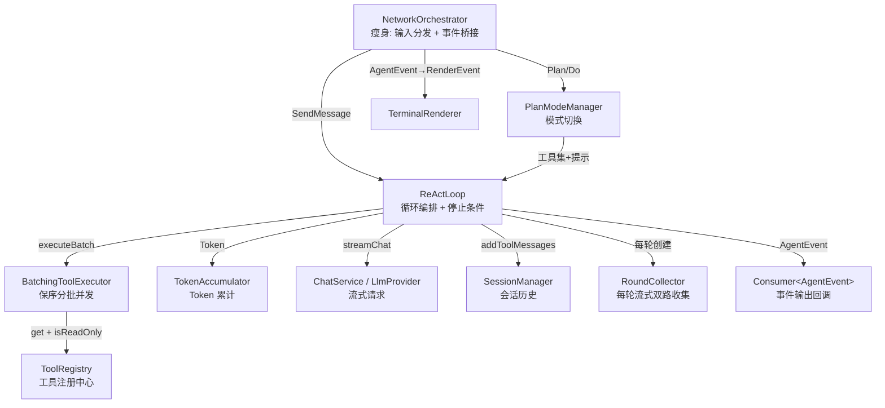
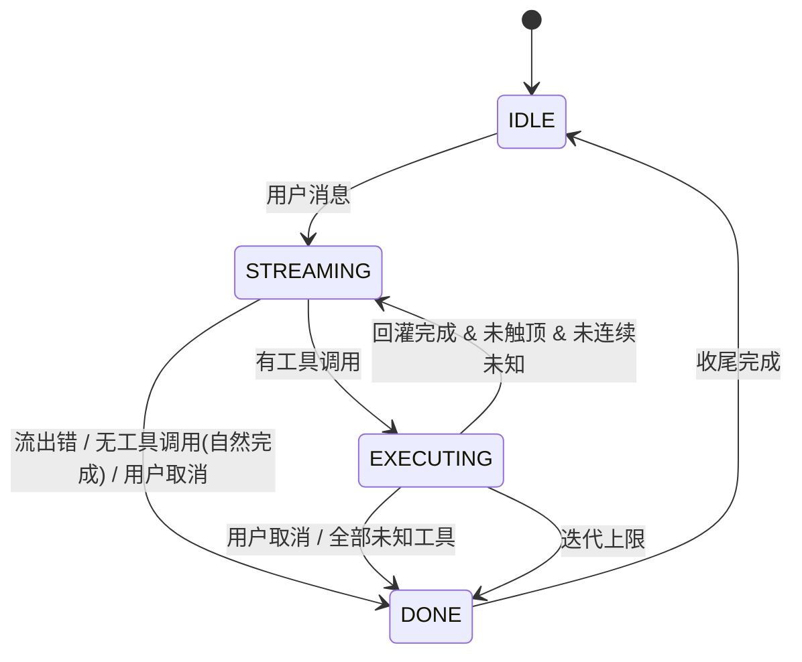

# Agent Loop（ReAct 循环）设计文档

> 日期：2026-07-01 · 状态：待评审
>
> 关联文档：
> - [Agent Loop PRD v1.0](../../current/modules/agent-loop/PRD_产品概要说明书_v1.0.md)
> - [工具系统 TECH v1.1](../../current/modules/tool-system/TECH_详细设计规范_v1.1.md)

---

## 1. 设计目标与定位

### 1.1 核心定位

将 LavenderCode 从 ch03 的"单轮工具闭环"升级为 ReAct 模式的多轮自主循环。模型在每一轮中推理（生成文本）、行动（调用工具）、观察（看工具结果），循环直到任务完成。替换 ch03 中"续答阶段忽略工具调用"的限制。

### 1.2 设计原则

| 原则 | 说明 | 在本设计中如何体现 |
|:---|:---|:---|
| **组件职责分离** | 每个组件一个清晰职责，通过接口通信，可独立理解和测试 | ReActLoop / BatchingToolExecutor / PlanModeManager 三组件独立 |
| **TDD 测试隔离** | 每个组件可独立 mock 依赖进行单元测试 | ReActLoop mock Provider 测循环；BatchingToolExecutor mock Tool 测并发 |
| **事件驱动解耦** | Agent 对外只吐事件，界面只消费事件 | AgentEvent sealed interface，ReActLoop 不依赖 RenderEvent |
| **历史原子性** | assistant 回合与工具结果配对写入，不可分割 | 取消时先补"已取消"结果再一次性写入 |
| **最小侵入** | 复用现有架构，新增而非重写 | NetworkOrchestrator 瘦身保留；Provider 接口不破坏性变更 |
| **虚拟线程优先** | I/O 密集型并发用 Java 21 虚拟线程 | BatchingToolExecutor 并发批用 newVirtualThreadPerTaskExecutor |

### 1.3 验收标准对齐

本设计满足 PRD 中 AC1-AC14 共 14 项验收标准，详见第 9 节 TDD 测试规格。

---

## 2. 架构与组件边界

### 2.1 新增/变更组件清单

| 组件 | 类型 | 职责 | 测试隔离点 |
|:---|:---|:---|:---|
| `ReActLoop` | 新增 | 驱动多轮循环、管理 5 种停止条件、迭代计数、Token 累计 | mock ChatService/Provider 返回多轮响应序列，收集 AgentEvent 断言 |
| `BatchingToolExecutor` | 新增 | 按安全性分批（只读并发/副作用串行），结果按原始顺序收集 | mock Tool 验证并发/串行/保序 |
| `PlanModeManager` | 新增 | /plan /do 模式状态、工具集过滤、系统提示切换 | 验证模式切换后导出的工具集 |
| `AgentEvent` | 新增 | sealed interface，ReActLoop 对外事件流 | 收集事件列表断言序列 |
| `TokenAccumulator` | 新增 | 跨轮累加输入/输出 Token | 纯逻辑，无依赖 |
| `Tool` 接口 | 变更 | 新增 `default boolean isReadOnly() { return false; }` | — |
| `ToolRegistry` | 变更 | 新增 `exportReadOnly()` 导出只读子集 | — |
| `ToolResult` | 变更 | 新增 `cancelled()` 工厂方法 | — |
| `NetworkOrchestrator` | 变更/瘦身 | 退化为输入事件分发 + 委托 ReActLoop + AgentEvent→RenderEvent 桥接 | — |
| `InputEvent` | 变更 | 新增 PLAN / DO / ESC_CANCEL 命令类型 | — |
| `AgentPromptBuilder` | 变更 | 新增 `buildPlan()` 计划态提示 | — |
| `StreamEvent` | 变更 | 新增 `Usage` record（若尚不存在） | — |

### 2.2 组件依赖关系



### 2.3 关键设计原则

1. **ReActLoop 不依赖 RenderEvent**——只通过 `Consumer<AgentEvent>` 回调输出事件，NetworkOrchestrator 负责转换为 RenderEvent。测试只需收集 AgentEvent 列表。

2. **BatchingToolExecutor 不依赖 LLM**——只接收 `List<ToolCall>`，返回 `List<ToolResult>`（按原始顺序）。纯单元测试，mock Tool 即可。

3. **PlanModeManager 不依赖循环逻辑**——只持有模式状态，对外提供 `getToolDefinitions()` 和 `getSystemPrompt()`。

4. **RoundCollector 封装每轮双路收集**——ReActLoop 每轮创建一个 RoundCollector 实例，委托它迭代 StreamEventIterator。

---

## 3. ReActLoop 循环状态机与停止条件

### 3.1 简化状态机

替换 ch03 的 6 状态（IDLE/STREAMING/EXECUTING/REINJECTING/STREAMING_FINAL/DONE）为 4 状态 + StopReason：



```java
enum LoopState { IDLE, STREAMING, EXECUTING, DONE }

enum StopReason {
    NATURAL_COMPLETION,   // AC2
    MAX_ITERATIONS,       // AC3
    USER_CANCELLED,       // AC10
    UNKNOWN_TOOLS,        // AC4
    STREAM_ERROR          // AC5
}
```

### 3.2 循环主逻辑

```java
void run(String userMessage, Consumer<AgentEvent> sink) {
    sessionManager.addUserMessage(userMessage);
    int iteration = 0;
    int unknownStreak = 0;
    AtomicBoolean cancelFlag = new AtomicBoolean(false);

    while (true) {
        iteration++;
        sink.accept(new AgentEvent.RoundStart(iteration));

        // 1. 流式收集双路（RoundCollector）
        RoundResult result;
        try {
            result = collectRound(sink, cancelFlag);
        } catch (StreamFailedException e) {
            sink.accept(new AgentEvent.Error(e.getMessage()));
            return;  // AC5: 流出错，历史不需补偿（本轮未产出工具调用）
        }

        if (cancelFlag.get()) {
            // 流式期间取消，丢弃本轮不完整响应
            return;  // AC10: 不写入历史
        }

        sink.accept(new AgentEvent.Usage(
            tokenAccumulator.getTotalInput(),
            tokenAccumulator.getTotalOutput()
        ));

        // 2. 自然完成判断
        if (result.toolCalls().isEmpty()) {
            sessionManager.addAssistantMessage(result.fullText());
            sink.accept(new AgentEvent.Complete());
            return;  // AC2
        }

        // 3. 连续未知工具检查
        if (allUnknown(result.toolCalls())) {
            unknownStreak++;
            if (unknownStreak >= MAX_UNKNOWN_ROUNDS) {
                sessionManager.addToolMessages(result.toolCalls(), results);
                sink.accept(new AgentEvent.Stopped(UNKNOWN_TOOLS, "连续请求未知工具"));
                return;  // AC4
            }
        } else {
            unknownStreak = 0;
        }

        // 4. 保序分批执行
        List<ToolResult> results = batchExecutor.execute(
            result.toolCalls(), sink, cancelFlag
        );

        // 5. 原子写入历史（含取消时的"已取消"结果）
        sessionManager.addToolMessages(result.toolCalls(), results);

        if (cancelFlag.get()) {
            sink.accept(new AgentEvent.Stopped(USER_CANCELLED, "用户中断"));
            return;  // AC10
        }

        // 6. 迭代上限检查
        if (iteration >= MAX_ITERATIONS) {
            sink.accept(new AgentEvent.Stopped(MAX_ITERATIONS, "已达迭代上限"));
            return;  // AC3
        }

        sink.accept(new AgentEvent.RoundEnd(iteration));
        // 继续下一轮
    }
}
```

### 3.3 五种停止条件检查点

| 停止条件 | 检查点 | 收尾行为 | 对应 AC |
|:---|:---|:---|:---|
| 自然完成 | 流式收集后，无工具调用 | 输出 Complete()，纯文本作为 assistant 消息写入历史 | AC2 |
| 流出错 | 流式收集期间收到 Error 事件 | 输出 Error(msg)，历史不写入（本轮无工具调用），回 IDLE | AC5 |
| 用户取消 | 流式期间 / 工具执行前 / 工具执行中 | 为未完成工具补"已取消"结果，原子写入历史，输出 Stopped(CANCELLED) | AC10 |
| 迭代上限 | 回灌后、下一轮开始前 | 输出 Stopped(MAX_ITERATIONS)，历史已合法 | AC3 |
| 连续未知工具 | 工具执行后检查全部未知 | 原子写入历史（含错误结果），输出 Stopped(UNKNOWN_TOOLS) | AC4 |

### 3.4 内置常量

| 常量 | 值 | 说明 |
|:---|:---|:---|
| `MAX_ITERATIONS` | 10 | 沿用 ch03 值，迭代上限兜底。测试中通过构造函数注入调低 |
| `MAX_UNKNOWN_ROUNDS` | 3 | 连续 3 轮全部未知工具即停。测试中通过构造函数注入调低 |

ReActLoop 构造函数接受 `maxIterations` 和 `maxUnknownRounds` 参数，生产环境使用默认值，测试环境注入小值。

---

## 4. BatchingToolExecutor 保序分批并发

### 4.1 分批算法

扫描模型给出的工具调用列表，连续只读调用合并为一个并发批，遇到副作用调用或未知工具则先 flush 当前并发批再单独串行：

```
partition(toolCalls) → List<ToolBatch>
  currentBatch = []
  for tc in toolCalls:
    tool = registry.get(tc.name())
    if tool == null:              // 未知工具
      flush(currentBatch); currentBatch = []
      emit Batch([tc], serial)   // 单独串行（返回错误结果）
    elif tool.isReadOnly():
      currentBatch.add(tc)       // 加入并发批
    else:                         // 副作用工具
      flush(currentBatch); currentBatch = []
      emit Batch([tc], serial)   // 单独串行
  flush(currentBatch)
```

**示例**：模型请求 `[read_file, read_file, write_file, read_file, edit_file, glob]`

分批结果：`[[read_file, read_file] 并发] → [write_file] 串行 → [read_file] 串行 → [edit_file] 串行 → [glob] 并发(单元素)`

### 4.2 并发模型——Java 21 虚拟线程

```java
private List<ToolResult> executeConcurrent(List<ToolCall> batch, AtomicBoolean cancelFlag) {
    try (var executor = Executors.newVirtualThreadPerTaskExecutor()) {
        // 按原始顺序提交，每个工具一个虚拟线程
        List<Future<ToolResult>> futures = batch.stream()
            .map(tc -> executor.submit(() -> executeOne(tc, cancelFlag)))
            .toList();

        // 按原始顺序收集结果——即使后提交的先完成也保证有序
        List<ToolResult> results = new ArrayList<>();
        for (Future<ToolResult> f : futures) {
            results.add(f.get());
        }
        return results;
    }  // try-with-resources 确保所有虚拟线程结束才退出（满足 N5）
}
```

选择虚拟线程的理由：工具执行是 I/O 密集型（文件读写、命令执行），虚拟线程在 I/O 阻塞时自动让出；轻量级不耗尽平台线程；try-with-resources 确保无残留。

### 4.3 per-tool 超时（沿用 ch03）

```java
private ToolResult executeOne(ToolCall tc, AtomicBoolean cancelFlag) {
    if (cancelFlag.get()) return ToolResult.cancelled(tc.name());

    Tool tool = registry.get(tc.name());
    if (tool == null) return ToolResult.error("TOOL_NOT_FOUND", "工具未注册·" + tc.name(), ...);

    long timeout = "execute_command".equals(tc.name()) ? 120 : 30;
    try {
        return CompletableFuture.supplyAsync(() -> tool.execute(tc.parameters()))
            .orTimeout(timeout, TimeUnit.SECONDS)
            .exceptionally(ex -> ToolResult.error("TIMEOUT", "超时·" + tc.name(), ...))
            .get();
    } catch (Exception e) {
        return ToolResult.error("TOOL_ERROR", ...);
    }
}
```

### 4.4 取消传播

| 检查点 | 行为 |
|:---|:---|
| 批间（进入下一批前） | 若 cancelFlag 已设置，剩余所有工具补"已取消"结果 |
| 批内（executeOne 开头） | 若 cancelFlag 已设置，直接返回"已取消" |
| 正在执行的工具 | 靠 CompletableFuture.cancel() 尽力中断（I/O 可能不立即响应，N5 允许） |

### 4.5 串行批次

```java
private List<ToolResult> executeSerial(List<ToolCall> calls, AtomicBoolean cancelFlag) {
    List<ToolResult> results = new ArrayList<>();
    for (ToolCall tc : calls) {
        if (cancelFlag.get()) {
            results.add(ToolResult.cancelled(tc.name()));
        } else {
            results.add(executeOne(tc, cancelFlag));
        }
    }
    return results;
}
```

### 4.6 ToolResult 扩展

```java
// 新增工厂方法
public static ToolResult cancelled(String toolName) {
    return new ToolResult(false, "已取消·" + toolName, null, "CANCELLED", "用户中断", null);
}
```

---

## 5. 流式双路收集与 AgentEvent 事件流

### 5.1 RoundCollector——每轮双路收集

ReActLoop 每轮创建一个 RoundCollector，直接使用 `LlmProvider.streamChat()` 同步迭代流式响应：

```java
class RoundCollector {
    private final StringBuilder fullText = new StringBuilder();
    private final ToolCallAccumulator accumulator = new ToolCallAccumulator();
    private final Consumer<AgentEvent> sink;
    private int inputTokens, outputTokens;

    RoundResult consume(StreamEventIterator iter, AtomicBoolean cancelFlag) {
        while (iter.hasNext() && !cancelFlag.get()) {
            StreamEvent se = iter.next();
            switch (se) {
                case ContentDelta cd -> {
                    fullText.append(cd.text());                    // 路 B：累积
                    sink.accept(new AgentEvent.Content(cd.text())); // 路 A：实时推送
                }
                case ToolCallStart tcs -> {
                    accumulator.start(tcs.toolCallId(), tcs.toolName());
                    sink.accept(new AgentEvent.ToolCallStart(tcs.toolCallId(), tcs.toolName()));
                }
                case ToolCallDelta tcd -> accumulator.append(tcd.toolCallId(), tcd.jsonFragment());
                case ToolCallEnd tce -> {
                    ToolCall call = accumulator.complete(tce.toolCallId());
                    sink.accept(new AgentEvent.ToolCallEnd(call));
                }
                case Usage u -> { inputTokens = u.inputTokens(); outputTokens = u.outputTokens(); }
                case StreamError err -> throw new StreamFailedException(err);
                case StreamComplete sc -> { /* 流结束 */ }
                case ThinkingDelta td -> { /* 接收即丢弃，沿用 ch03 */ }
            }
        }
        if (cancelFlag.get()) iter.close();
        return new RoundResult(fullText.toString(), accumulator.completedCalls(), inputTokens, outputTokens);
    }
}
```

**双路分离点**：ContentDelta 分支同时做两件事——`fullText.append()`（累积供循环判断）和 `sink.accept(Content)`（实时推界面）。工具调用通过 ToolCallAccumulator 拼接分片 JSON，ToolCallEnd 时产出完整 ToolCall。

### 5.2 ReActLoop 直接用 LlmProvider 而非 ChatService

| 维度 | 直接用 LlmProvider | 通过 ChatService 异步回调 |
|:---|:---|:---|
| 测试 mock | mock streamChat() 返回迭代器，同步迭代 | 需处理异步回调+CountDownLatch 等待 |
| 取消 | 直接 iter.close() + cancelFlag | 需通过 RequestContext 间接取消 |
| 循环控制 | 同步 while 循环，逻辑清晰 | 异步回调中嵌套循环判断 |
| 复用 | RoundCollector 封装收集逻辑 | StreamingChatService 仍可用于无工具场景 |

ChatService/StreamingChatService 保留用于无工具降级场景，ReActLoop 路径直接操作 provider。

### 5.3 AgentEvent 完整定义

```java
public sealed interface AgentEvent
    permits AgentEvent.Content,
            AgentEvent.ToolCallStart,
            AgentEvent.ToolCallEnd,
            AgentEvent.ToolResultReady,
            AgentEvent.Usage,
            AgentEvent.RoundStart,
            AgentEvent.RoundEnd,
            AgentEvent.Complete,
            AgentEvent.Stopped,
            AgentEvent.Error {

    record Content(String text) implements AgentEvent {}
    record ToolCallStart(String toolCallId, String toolName) implements AgentEvent {}
    record ToolCallEnd(ToolCall toolCall) implements AgentEvent {}
    record ToolResultReady(String toolCallId, ToolResult result) implements AgentEvent {}
    record Usage(int inputTokens, int outputTokens) implements AgentEvent {}
    record RoundStart(int round) implements AgentEvent {}
    record RoundEnd(int round) implements AgentEvent {}
    record Complete() implements AgentEvent {}
    record Stopped(StopReason reason, String message) implements AgentEvent {}
    record Error(String message) implements AgentEvent {}

    enum StopReason { NATURAL_COMPLETION, MAX_ITERATIONS, USER_CANCELLED, UNKNOWN_TOOLS, STREAM_ERROR }
}
```

> 用 `ToolResultReady` 而非 `ToolResult` 避免与 `com.lavendercode.core.tool.ToolResult` 类名冲突。

### 5.4 NetworkOrchestrator 桥接 AgentEvent → RenderEvent

| AgentEvent | 转换为 RenderEvent | 说明 |
|:---|:---|:---|
| `Content(text)` | `AppendToMessage(text)` 经 DeltaBuffer | 文本增量 |
| `ToolCallStart(id,name)` | `ToolCallRender(id,name,{},"准备中…")` | 工具行占位 |
| `ToolCallEnd(call)` | `ToolCallRender(id,name,params,"执行中…")` | 工具行补全参数 |
| `ToolResultReady(id,result)` | `ToolResultRender(id,summary,success,len)` | 工具结果摘要 |
| `Usage(in,out)` | `StatusUpdate(...,tokenCount=in+out)` | Token 累计 |
| `RoundStart(n)` | `StatusUpdate(...,"Round "+n+" …",...)` | 迭代进度 |
| `Complete()` | `FinalizeMessage()` + `StatusUpdate("Done")` | 自然完成 |
| `Stopped(reason,msg)` | `AddSystemMessage(msg)` + `FinalizeMessage()` | 非自然停止 |
| `Error(msg)` | `AddSystemMessage("[Error] "+msg)` + `FinalizeMessage()` | 错误 |

### 5.5 Token 用量提取

从代码分析确认 StreamEvent 目前没有 `Usage` 类型（现有 DeltaEvent 有 `Usage(int, int)` 但 [StreamingChatService.toDeltaEvent](file:///e:/learn/code/agent_learn/Lavendercode/src/main/java/com/lavendercode/chat/terminal/StreamingChatService.java#L122) 未映射）。需在 StreamEvent 中新增 `record Usage(int inputTokens, int outputTokens)` 并在两个 Provider 中从 SSE 的 `message_stop`（Anthropic）/ `chunk` 末尾的 `usage` 字段（OpenAI）提取。

ReActLoop 内部维护 TokenAccumulator，每轮收到 Usage 后累加，通过 `AgentEvent.Usage` 输出累计值（非单轮值）。

---

## 6. 取消机制与历史一致性

### 6.1 Esc 键解码

在 TerminalKeyReader 中新增 Esc 检测——当读到 `0x1B` 字节且后续不跟 `[`（CSI 前缀）时，识别为单独 Esc 键：

```
TerminalKeyReader.read()
  → 0x1B
    → 后续是 '[' → 走现有 CsiKeyDecoder（方向键等）
    → 后续不是 '[' → emit InputEvent.ExecuteCommand(ESC_CANCEL, "")
```

### 6.2 按键分工

| 键 | 命令类型 | 流式态行为 | 空闲态行为 |
|:---|:---|:---|:---|
| Esc | `ESC_CANCEL`（新增） | 中断循环，回空闲态，不退出 | 无操作（忽略） |
| Ctrl+C | `CANCEL`（现有） | 退出程序 | 退出程序 |

### 6.3 取消信号传播

```
Esc 键 → InputEvent(ESC_CANCEL)
  ↓
NetworkOrchestrator → reActLoop.cancel()
  ↓
cancelFlag.set(true)    // AtomicBoolean，ReActLoop 和 BatchingToolExecutor 共享
  ↓
ReActLoop 检查点：
  ├─ STREAMING：close(iterator)，丢弃本轮不完整响应，不写入历史
  └─ EXECUTING：等待 BatchingToolExecutor 返回（未完成工具补"已取消"）
       → 原子写入 assistant + tool 结果 → 输出 Stopped(CANCELLED)
```

### 6.4 关键设计：assistant 回合与工具结果原子写入

现有 ch03 的问题：工具执行和回灌分两步（先执行，后回灌），取消时回滚移除破坏配对。

新设计改为**原子写入**——assistant 回合和工具结果必须一起写入历史，不可分割：

```java
// ReActLoop 循环中
RoundResult result = roundCollector.collect(...);

if (result.hasError())     → stop(STREAM_ERROR)       // 本轮不写入历史
if (result.noTools())      → stop(NATURAL_COMPLETION)  // 纯文本作为 assistant 消息

// 有工具调用 → 执行 → 原子写入
List<ToolResult> results = batchExecutor.execute(result.toolCalls, cancelFlag);
// BatchingToolExecutor 保证返回与 toolCalls 等长的结果列表（每个都有结果）

// 一次性写入：assistant(含工具调用) + tool(结果) 配对完整
sessionManager.addToolMessages(result.toolCalls, results);
// 即使取消也走到这里——results 已包含"已取消"占位

if (cancelFlag.get())      → stop(USER_CANCELLED)
```

### 6.5 各终止路径的历史状态

| 终止路径 | 历史末尾 | 配对合法 | 可继续对话 |
|:---|:---|:---|:---|
| 自然完成 | `assistant(纯文本)` | 是 | 是 |
| 迭代上限 | `assistant(工具调用) → tool(结果)` | 是 | 是 |
| 用户取消（流式中） | 到上一轮为止（本轮丢弃） | 是 | 是 |
| 用户取消（工具执行中） | `assistant(工具调用) → tool(正常) → tool(已取消)` | 是 | 是 |
| 连续未知工具 | `assistant(工具调用) → tool(TOOL_NOT_FOUND)` | 是 | 是 |
| 流出错（无工具调用） | 到上一轮为止（本轮丢弃） | 是 | 是 |

### 6.6 历史合法性验证规则

SessionManager 历史在任何终止后必须满足：

1. **无连续同角色**——不能出现 `assistant → assistant` 或 `tool → tool`
2. **无悬空工具调用**——每个 `assistant(含toolCalls)` 后必须紧跟等数量的 `tool(结果)` 消息
3. **末尾合法**——历史末尾是 `assistant(纯文本)` 或 `tool(结果)` 或 `user`，不能是 `assistant(含toolCalls)`

---

## 7. Plan Mode + Token 累计与迭代进度

### 7.1 PlanModeManager

```java
public class PlanModeManager {
    public enum Mode { FULL, PLAN }
    private Mode mode = Mode.FULL;

    public void enterPlanMode()  { mode = Mode.PLAN; }
    public void exitToDo()       { mode = Mode.FULL; }
    public boolean isPlanMode()  { return mode == Mode.PLAN; }

    public List<ToolDefinition> getToolDefinitions() {
        return mode == Mode.PLAN ? ToolRegistry.exportReadOnly() : ToolRegistry.export();
    }

    public String getSystemPrompt(String userPrompt) {
        return mode == Mode.PLAN
            ? AgentPromptBuilder.buildPlan(userPrompt)
            : AgentPromptBuilder.build(userPrompt);
    }
}
```

### 7.2 /plan 与 /do 命令处理

```
/plan（模式切换，不触发请求）:
  → PlanModeManager.enterPlanMode()
  → 输出 "[已进入计划模式 · 仅只读工具可用]"
  → 等待用户输入任务

用户输入任务 → ReActLoop 用 exportReadOnly() + buildPlan() 发起循环
  → 模型只能调 read_file / glob / grep，产出计划文本（自然完成）

/do（模式切换 + 立即触发执行）:
  → PlanModeManager.exitToDo()
  → 构造内置触发消息 "请根据以上计划开始执行" → addUserMessage
  → ReActLoop 用 export()（全工具）+ build()（执行态提示）发起循环
```

`InputEvent.CommandType` 新增 `PLAN` 和 `DO`。

### 7.3 Tool 接口与 ToolRegistry 扩展

Tool 新增 `default` 方法：

```java
default boolean isReadOnly() { return false; }  // 默认副作用
```

各工具覆写情况：

| 工具 | isReadOnly |
|:---|:---|
| ReadFileTool | `true` |
| GlobTool | `true` |
| GrepTool | `true` |
| WriteFileTool | `false`（默认） |
| EditFileTool | `false`（默认） |
| ExecuteCommandTool | `false`（默认） |

ToolRegistry 新增：

```java
public static List<ToolDefinition> exportReadOnly() {
    return tools.values().stream()
        .filter(Tool::isReadOnly)
        .map(ToolRegistry::toDefinition)
        .toList();
}
```

### 7.4 AgentPromptBuilder 扩展

新增计划态提示：

```java
private static final String PLAN_PROMPT = """
    You are LavenderCode Agent in PLAN MODE.
    You are in read-only exploration mode. Only read-only tools are available
    (read_file, glob, grep). DO NOT attempt to write, edit, or execute commands.
    Your goal is to explore the codebase and produce a clear, actionable plan.
    After exploring, provide a step-by-step plan describing what files to
    read/modify and what commands to run. The user will switch to /do to execute.
    """;

public static String buildPlan(String userSystemPrompt) { /* 同 build() 结构 */ }
```

### 7.5 TokenAccumulator

```java
public class TokenAccumulator {
    private int totalInput = 0;
    private int totalOutput = 0;

    public void add(int in, int out) { totalInput += in; totalOutput += out; }
    public int getTotalInput()  { return totalInput; }
    public int getTotalOutput() { return totalOutput; }
    public int getTotal()        { return totalInput + totalOutput; }
    public void reset()         { totalInput = 0; totalOutput = 0; }
}
```

ReActLoop 每轮收到 Usage → `accumulator.add()` → 输出 `AgentEvent.Usage(累计值)`。/clear 时 reset()。

### 7.6 迭代进度与状态栏

| 循环阶段 | 状态栏展示 |
|:---|:---|
| RoundStart(n) | `Round {n} · Imagining… ({elapsed}s)` |
| 工具执行中 | `Round {n} · Executing {toolName}…` |
| Complete() | `Done ({total}s) · Tokens: {total}` |
| Stopped(reason) | `Stopped: {message} · Tokens: {total}` |

### 7.7 /help 更新

新增命令说明：
```
/plan       - Enter plan mode (read-only tools only)
/do         - Switch to full tools and execute plan
Esc         - Cancel current loop (streaming only)
```

---

## 8. 新增/变更文件清单

| 文件 | 变更类型 | 所属包 | 说明 |
|:---|:---|:---|:---|
| `chat/terminal/ReActLoop.java` | 新增 | `com.lavendercode.chat.terminal` | ReAct 循环编排器 |
| `chat/terminal/RoundCollector.java` | 新增 | `com.lavendercode.chat.terminal` | 每轮流式双路收集（ReActLoop 内部类或独立类） |
| `chat/terminal/BatchingToolExecutor.java` | 新增 | `com.lavendercode.chat.terminal` | 保序分批并发执行器 |
| `chat/terminal/PlanModeManager.java` | 新增 | `com.lavendercode.chat.terminal` | Plan Mode 模式管理 |
| `chat/terminal/AgentEvent.java` | 新增 | `com.lavendercode.chat.terminal` | 异步事件流 sealed interface |
| `chat/terminal/TokenAccumulator.java` | 新增 | `com.lavendercode.chat.terminal` | Token 跨轮累计 |
| `chat/terminal/RoundResult.java` | 新增 | `com.lavendercode.chat.terminal` | 每轮收集结果（fullText + toolCalls + tokens） |
| `core/tool/Tool.java` | 修改 | `com.lavendercode.core.tool` | 新增 `default boolean isReadOnly()` |
| `core/tool/ToolResult.java` | 修改 | `com.lavendercode.core.tool` | 新增 `cancelled()` 工厂方法 |
| `core/tool/ToolRegistry.java` | 修改 | `com.lavendercode.core.tool` | 新增 `exportReadOnly()` |
| `chat/terminal/AgentPromptBuilder.java` | 修改 | `com.lavendercode.chat.terminal` | 新增 `buildPlan()` |
| `chat/terminal/NetworkOrchestrator.java` | 修改 | `com.lavendercode.chat.terminal` | 瘦身：委托 ReActLoop + 事件桥接 |
| `chat/terminal/InputEvent.java` | 修改 | `com.lavendercode.chat.terminal` | 新增 PLAN / DO / ESC_CANCEL |
| `chat/terminal/TerminalKeyReader.java` | 修改 | `com.lavendercode.chat.terminal` | 新增 Esc 键解码 |
| `core/provider/StreamEvent.java` | 修改 | `com.lavendercode.core.provider` | 新增 Usage record（若尚不存在） |
| `core/anthropic/AnthropicProvider.java` | 修改 | `com.lavendercode.core.anthropic` | 提取 usage 字段为 StreamEvent.Usage |
| `core/openai/OpenAIProvider.java` | 修改 | `com.lavendercode.core.openai` | 提取 usage 字段为 StreamEvent.Usage |
| `chat/session/InMemorySessionManager.java` | 修改 | `com.lavendercode.chat.session` | addToolMessages 确保原子写入 |

---

## 9. TDD 测试规格

### 9.1 测试类划分

| 测试类 | 测试目标 | mock 依赖 |
|:---|:---|:---|
| `ReActLoopTest` | 循环逻辑、停止条件、事件输出、历史一致性 | LlmProvider, BatchingToolExecutor, SessionManager |
| `BatchingToolExecutorTest` | 分批策略、并发/串行、保序、取消、超时 | Tool, ToolRegistry |
| `PlanModeManagerTest` | 模式切换、工具集过滤、提示切换 | ToolRegistry |
| `TokenAccumulatorTest` | 累加、reset | 无（纯逻辑） |
| `NetworkOrchestratorBridgeTest` | AgentEvent→RenderEvent 桥接 | ReActLoop (mock) |

### 9.2 Mock 多轮 LLM 响应

```java
/** 构造一个按序产出 StreamEvent 的 mock 迭代器 */
private StreamEventIterator mockIterator(StreamEvent... events) {
    StreamEventIterator iter = mock(StreamEventIterator.class);
    Boolean[] hasNext = new Boolean[events.length + 1];
    Arrays.fill(hasNext, true);
    hasNext[events.length] = false;
    when(iter.hasNext()).thenReturn(hasNext[0], Arrays.copyOfRange(hasNext, 1, hasNext.length));
    when(iter.next()).thenReturn(events[0], Arrays.copyOfRange(events, 1, events.length));
    return iter;
}

/** 按调用次数返回不同迭代器（模拟多轮） */
when(provider.streamChat(anyList(), any(), anyList()))
    .thenReturn(iterRound1)
    .thenReturn(iterRound2);
```

### 9.3 AC → 测试用例映射

| AC | 测试方法 | Mock 策略 | 断言 |
|:---|:---|:---|:---|
| AC1 | `shouldRunMultipleRoundsUntilNoTools` | R1 返回 read_file 工具调用 → R2 返回纯文本 | AgentEvent 含 RoundStart(1)...ToolResultReady...RoundStart(2)...Complete；循环 2 轮结束 |
| AC2 | `shouldStopOnPureTextNoTools` | R1 返回纯文本无工具调用 | 最后事件为 Complete()，iteration=1 |
| AC3 | `shouldStopAtMaxIterations` | 每轮都返回工具调用，MAX_ITERATIONS=3 | 3 轮后 Stopped(MAX_ITERATIONS)，历史合法 |
| AC4 | `shouldStopOnConsecutiveUnknownTools` | R1-R3 都返回 "fake_tool" 调用 | 3 轮后 Stopped(UNKNOWN_TOOLS) |
| AC5 | `shouldRecoverFromStreamError` | R1 返回 StreamError | 输出 Error(msg)，循环停止；再发消息可继续对话 |
| AC6 | `shouldEmitAllEventTypes` | R1 返回工具调用+Usage，R2 返回纯文本 | 事件含 Content/ToolCallStart/ToolCallEnd/ToolResultReady/Usage/RoundStart/RoundEnd/Complete |
| AC7 | `shouldPushTextRealtimeWhileAccumulating` | R1 返回分片 JSON 工具调用 | Content 在 ToolCallEnd 之前到达；ToolCallEnd.toolCall().parameters() 完整拼齐 |
| AC8 | `BatchingToolExecutorTest`（3 个方法） | 3 只读 Tool 各 sleep 不同时间；2 副作用 Tool；混合 read→write→read | 总耗时≈最慢者；按序不重叠；结果按原始顺序 |
| AC9 | `shouldKeepHistoryLegalAfterCancel` | R1 返回 2 工具调用，第 1 个完成后取消 | 历史无连续同角色、无悬空 toolCall、末尾合法 |
| AC10 | `shouldStopOnUserCancel` | R1 返回工具调用，执行中 set cancelFlag | Stopped(USER_CANCELLED)；未完成工具补"已取消" |
| AC11 | `shouldAccumulateTokensAcrossRounds` | R1 返回 Usage(100,50)，R2 返回 Usage(200,80) | 第 2 轮 AgentEvent.Usage 为 (300,130) |
| AC12 | `shouldEmitRoundProgress` | 3 轮循环 | RoundStart(1)→RoundEnd(1)→RoundStart(2)→...→RoundStart(3) |
| AC13 | `PlanModeManagerTest`（2 个方法） | /plan 后 getToolDefinitions() | 只含 read_file/glob/grep（3 个）；/do 后含全部 6 个 |
| AC14 | `shouldBehaveIdenticallyAcrossProviders` | 分别 mock Anthropic/OpenAI Provider | 两者 AgentEvent 序列、历史结构、停止行为一致 |

### 9.4 历史合法性验证工具方法

```java
private void assertHistoryLegal(SessionManager sm) {
    List<Message> history = sm.getHistory();
    for (int i = 0; i < history.size(); i++) {
        Message msg = history.get(i);
        // 1. 无连续同角色
        if (i > 0) {
            assertThat(msg.role()).isNotEqualTo(history.get(i - 1).role());
        }
        // 2. 无悬空工具调用
        if (msg.hasToolCalls()) {
            int toolCount = msg.toolCalls().size();
            long toolResults = countFollowingToolMessages(history, i + 1);
            assertThat(toolResults).isEqualTo(toolCount);
        }
    }
    // 3. 末尾合法
    Role lastRole = history.get(history.size() - 1).role();
    assertThat(lastRole).isIn(Role.USER, Role.ASSISTANT, Role.TOOL);
}
```

### 9.5 TDD 实施顺序（红→绿→重构）

1. `TokenAccumulatorTest` → TokenAccumulator（无依赖，最简单）
2. `PlanModeManagerTest` → PlanModeManager（依赖 ToolRegistry）
3. `BatchingToolExecutorTest` → BatchingToolExecutor + Tool.isReadOnly + ToolResult.cancelled
4. `ReActLoopTest` AC2/AC3/AC4/AC5 → ReActLoop 停止条件
5. `ReActLoopTest` AC1/AC6/AC7/AC11/AC12 → ReActLoop 多轮循环 + 事件流
6. `ReActLoopTest` AC9/AC10 → 取消 + 历史一致性
7. `PlanModeManagerTest` AC13 → /plan /do 集成
8. `NetworkOrchestratorBridgeTest` → AgentEvent→RenderEvent 桥接
9. AC14 → 双 Provider mock 对比

---

## 10. 不做的事

与 PRD 第十章一致：权限系统、上下文压缩、工具沙箱、调用持久化、迭代上限配置化、跨批重排并发、子 Agent/Task 工具、Plan Mode 计划落盘/审批门、Token 预算限制、多模态、流式工具结果。
