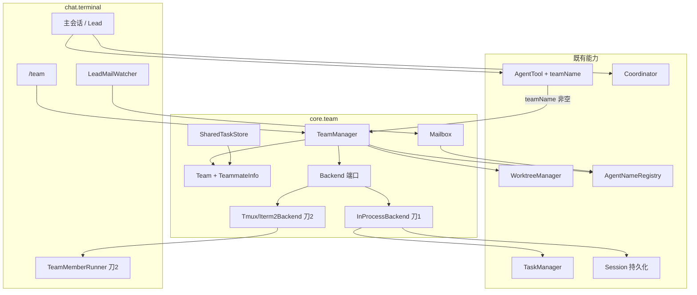

# Agent Team 实现设计

> 日期：2026-07-15 · 状态：待评审  
> 关联 PRD：[PRD_TeamLead.md](../../current/modules/agent-team/PRD_TeamLead.md)  
> 关联需求 Spec：[2026-07-15-agent-team-spec.md](./2026-07-15-agent-team-spec.md)  
> 关联能力：SubAgent · Worktree · Session 持久化 · Permission Plan · Slash · TaskManager
>
> **命名对齐（强制）**：LavenderCode / `.lavendercode` / `com.lavendercode` / `LAVENDERCODE_COORDINATOR_MODE`。  
> **工具命名**：协作五件套 `TeamTask*` / `TeamSendMessage`；ch13 后台 `Task*` / `SendMessage` 不改名。读/命令类：`read_file` / `search_file` / `search_content` / `execute_command`。

本文档为实现与测试真源。PRD 描述业务目标；需求 Spec 描述 G/F/AC 明细；本文档描述架构切分、组件接口、数据流、错误处理与测试策略。

**已拍板决策**：

| 议题 | 决定 |
| :--- | :--- |
| 架构路线 | 域核心 + Backend 端口（不把 Team 语义塞进 TaskManager） |
| 实现分期 | **刀 1**：域 + Mailbox + 共享任务 + InProcess + 协作工具 + Plan + Coordinator + `/team` + Lead 收信；**刀 2**：tmux / iTerm2 + TeamMemberRunner |
| 刀 1 检出窗格后端 | **明确失败**，禁止静默降级；显式 `LAVENDERCODE_TEAM_BACKEND=in-process` 可强制同进程 |
| 持久化根 | `~/.lavendercode/teams/` |
| Coordinator 环境变量 | `LAVENDERCODE_COORDINATOR_MODE` |

---

## 1. 概述

### 1.1 目标映射

| Spec | 设计章节 | 摘要 |
| :--- | :--- | :--- |
| G1–G4 | §2、§3 | Team / TeamManager 生命周期 |
| G5、F11–F19 | §2 Backend | 端口 + 刀1 InProcess；刀2 Pane |
| G6–G10 | §2、§3 | Team* 工具、Mailbox、消息注入 |
| G11–G13 | §3 | 派生路径、空闲、续派 |
| G14 | §3.4 | Plan 审批 |
| G15–G16 | §3.5 | Coordinator + git 收敛 |
| G17 | §2 TUI | `/team` |
| G18 | §1.3 | 与 ch13 共存边界 |
| N1–N9 / AC* | §4、§5 | 错误与测试 |

### 1.2 现状与改造落点

| 现状 | 改造 |
| :--- | :--- |
| 星型 SubAgent + 内存续派 | 新增 `core.team` 网状协作；队员 session 落盘后续派 |
| `TaskManager` / `SendMessage` 后台续聊 | **保留**；Team 侧用 `TeamSendMessage` |
| `WorktreeManager` 嵌套 slug | 队员 slug `team-<sanitized>/<member>` |
| `ToolFilter` | 队员注入协作五件套；Coordinator 白名单收窄 Lead |
| `PermissionMode.PLAN` | `planModeRequired` + `plan_approval_response` 协议 |
| 无 Feature 双锁 | `Options.features.coordinatorMode` + 环境变量 |
| 无 `/team` | `BuiltinCommandRegistrar` 增补 |

### 1.3 本期范围外

跨进程共享活跃 Team、跨机器、实时流式、复杂依赖/自动调度、细粒度限额、结构化 Plan 类型、Windows iTerm2、Coordinator 运行时解锁、跨 Team 寻址、插件后端。  
刀 1 不交付 Pane 实跑；刀 2 补齐。

---

## 2. 总体架构



| 层 | 职责 | 约束 |
| :--- | :--- | :--- |
| `core.team` | 生命周期、邮箱、共享任务、Backend 端口 | **不** import `chat.terminal` |
| `core.coordinator` | 双锁、白名单、提示词后缀 | 启动时作用于 Lead |
| `core.tool` | Team* 工具；`Agent.teamName` 分支 | 调 TeamManager |
| `chat.terminal` | `/team`、Lead 收信、刀2 Runner | 可依赖 `core.*` |

---

## 3. 组件与接口

### 3.1 包结构

```text
com.lavendercode.core.team
  Team, TeammateInfo, TeamManager
  Mailbox, MailMessage
  SharedTaskStore, SharedTask
  Backend, BackendType, BackendFactory
  SpawnRequest, SpawnResult
  InProcessBackend                 # 刀1
  TmuxBackend, Iterm2Backend       # 刀2
  异常：TeamNotFoundException, TeamHasActiveMembersException,
        InProcessTeammateNoSpawnException, BackendNotAvailableException

com.lavendercode.core.coordinator
  Coordinator                      # isEnabled / ALLOWED_TOOLS / SYSTEM_PROMPT_SUFFIX

com.lavendercode.core.task
  AgentNameRegistry                # 新建；统一 name↔agentId

com.lavendercode.core.tool
  TeamCreateTool, TeamDeleteTool
  TeamTaskCreateTool, TeamTaskGetTool, TeamTaskListTool, TeamTaskUpdateTool
  TeamSendMessageTool
  AgentTool                        # + teamName

com.lavendercode.core.config
  Options                          # + features.coordinatorMode / forkTeammate

com.lavendercode.chat.terminal
  LeadMailWatcher, LeadMailWaiter  # 刀1
  TeamMemberRunner                 # 刀2
  BuiltinCommandRegistrar          # + /team
```

### 3.2 关键 API（刀 1 必须）

| 组件 | 契约 |
| :--- | :--- |
| `TeamManager` | `create` / `get` / `delete(force)` / `spawnTeammate` / `pollLeadMailboxes`；启动扫描 `~/.lavendercode/teams/` |
| `Team` | `addMember` / `setMemberActive` / `removeMember`；写前 `reloadFromDiskLocked`；原子写 `config.json` |
| `Mailbox` | `write` / `readUnread` / `markRead`；锁 CREATE_NEW + 5–100ms 抖动 ≤10 + 10s stale |
| `SharedTaskStore` | CRUD；双向 blocks/blockedBy；`isReady`；`tasks.lock` |
| `Backend` | `spawn` / `wake` / `kill` |
| `Backend.detect()` | `$TMUX` → iTerm2+`it2` → PATH `tmux` → `IN_PROCESS` |
| `InProcessBackend` | `TaskManager.launch` + `withCwd(worktree)`；`wake` no-op；`kill`→`stop` |
| `AgentNameRegistry` | `register` / `unregister` / `resolve` / `nameOf`；后覆盖前 |
| `Coordinator.isEnabled` | `features.coordinatorMode` ∧ envTruthy(`LAVENDERCODE_COORDINATOR_MODE`) |
| `Coordinator.ALLOWED_TOOLS` | `Agent`, `TeamCreate`, `TeamDelete`, `TeamTaskCreate`, `TeamTaskGet`, `TeamTaskList`, `TeamTaskUpdate`, `TeamSendMessage`, `read_file`, `search_file`, `search_content`, `execute_command` |
| `AgentTool` | `teamName` 非空：校验 Team → Worktree → sessionDir → 注入协作工具 + dontAsk + 提示 → spawn → registry → members |
| `TeamSendMessageTool` | 投递；刀2 wake；刀1 目标已 stop 则 session 续派 |

### 3.3 Feature 开关

| 键 | 默认 | 含义 |
| :--- | :--- | :--- |
| `features.coordinatorMode` | false | Coordinator 能力开关（双锁之一） |
| `features.forkTeammate` | false | 允许空 `subagentType` 走 Fork 继承 Lead 对话 |

不新建独立 AppConfig 框架；扩展既有 `Options` / YAML 即可。

### 3.4 刀 1 / 刀 2 后端策略

- 刀 1 仅实现 `InProcessBackend`。
- `detect()` 仍按 Spec 优先级执行；若结果为 `TMUX`/`ITERM2` 且刀 2 未交付 → 抛 `BackendNotAvailableException`（中文说明原因）。
- **强制同进程（刀 1 验收）**：环境变量 `LAVENDERCODE_TEAM_BACKEND=in-process` 时跳过检测、直接 `IN_PROCESS`（仅该显式覆盖允许“降级”，不算静默）。单测可通过 `BackendFactory.overrideDetectForTests(...)` 注入。

---

## 4. 数据流

### 4.1 建组 → 派工（刀 1）

```text
TeamCreate → TeamManager.create
  sanitize → 唯一名 → ~/.lavendercode/teams/<s>/config.json + lead 成员
Agent(teamName, name=alice, prompt)
  → Worktree team-<s>/alice
  → 新 sessionDir + jsonl Writer
  → 注入 Team* + team 提示 + <team-context> + dontAsk
  → InProcessBackend.spawn → TaskManager.launch(withCwd)
  → registry + addMember (reload-before-modify)
```

### 4.2 队员消息环

```text
TeamSendMessage(to / * / type / summary / message / payload)
  → Registry → Mailbox.write
  → [刀2] wake；[刀1 已 stop] Session.load → 续派 → setMemberActive(true)

队员每轮 LLM 前：
  readUnread → <incoming-messages> → markRead
  按 type 处理 text / plan_approval / shutdown
```

### 4.3 Lead 收信

```text
队员结束 → isActive=false + Lead mailbox idle
LeadMailWatcher ~1s → <team-update> + leadMailQueue
IDLE → 合成 user 消息 beginAutonomousTurn
非 IDLE → 下一轮 LLM 前取 pendingReminders
```

### 4.4 Plan 审批

```text
planModeRequired → PLAN
队员 TeamSendMessage(plan 文本) → Lead
Lead plan_approval_response
  approve → 队员切 DEFAULT 继续
  reject → feedback 入对话 + 重回 PLAN
```

### 4.5 Coordinator 与收敛

```text
双锁 → 白名单 + 提示词 + 状态栏 [COORDINATOR]
收敛：execute_command 逐个 git merge --no-ff
搞不定：git merge --abort，保留队员 worktree，上报用户
```

### 4.6 持久化路径

| 数据 | 路径 |
| :--- | :--- |
| Team 配置 | `~/.lavendercode/teams/<s>/config.json` |
| 共享任务 | `.../tasks.json` + `tasks.lock` |
| 邮箱 | `.../mailbox/<agentId>.json` + `.lock` |
| 队员对话 | `<project>/.lavendercode/sessions/<id>/conversation.jsonl` |
| 队员 Worktree | `<project>/.lavendercode/worktrees/team-<s>+<member>/` |

---

## 5. 错误处理

| 场景 | 行为 |
| :--- | :--- |
| sanitize 空 / Team 不存在 | 明确错误 |
| 同名 Team | 自动 `-2`/`-3` |
| 非 force 删除且有活跃成员 | `TeamHasActiveMembersException` |
| 刀1 检出未实现窗格后端 | `BackendNotAvailableException`，不静默降级 |
| in-process 队员再 team spawn | `InProcessTeammateNoSpawnException` |
| 邮箱锁竞争 | 抖动重试；stale 清锁；仍失败则工具错误 |
| 未知寻址 / 非 Lead 发审批 | 拒绝 |
| Pane 已死（刀2） | 报错，Lead 决定是否重派 |
| session 恢复失败 | 续派失败，提示可重派 |
| 清理部分失败 | 警告不中断 |
| Coordinator 单锁 | 不生效；进程内不可解锁 |
| merge 失败 | abort，保留 worktree，上报 |

错误文案中文，风格对齐现网 `ToolResult.error`。

---

## 6. 测试策略

### 6.1 刀 1

- **单测**：sanitize/同名；Team 护栏；Mailbox 锁/stale/并发 10 写；SharedTask 双向依赖与 `isReady`；Registry；Coordinator 四组合；工具可见性；`Agent.teamName` + 再派生拦截；Plan 批准切模式；idle→续派。
- **集成**：AC29 in-process 端到端。
- **回归**：`mvn test`、spotbugs；未建组主 Agent 工具面与 ch13 一致。

### 6.2 刀 2

- `Backend.detect` 环境桩；tmux spawn/wake（无 tmux 则 skip）；AC28 端到端。

### 6.3 弱测 / 不测

LLM 冲突解决质量；Windows iTerm2；跨机器。

---

## 7. 实现分期建议（供 writing-plans 拆任务）

**刀 1 建议序**：TeamManager 落盘 → Mailbox/SharedTask → Registry → InProcessBackend → Team* 工具 → Agent.teamName → Plan 协议 → 空闲/续派 → Coordinator → LeadMailWatcher → `/team` → 测试。

**刀 2 建议序**：TmuxBackend → Iterm2Backend → TeamMemberRunner CLI → wake/kill 接线 → detect 与刀1 错误路径改为真实 spawn → AC23/24/28。

---

## 8. 与需求 Spec 的差异声明（有意为之）

| 教学稿 / 初稿 | 本设计 |
| :--- | :--- |
| `TaskCreate` / `SendMessage` 等 | `TeamTask*` / `TeamSendMessage`（避撞名） |
| `mewcode` / `MEWCODE_*` / `.mewcode` | LavenderCode 命名全套 |
| `bash` / `glob` / `grep` | `execute_command` / `search_file` / `search_content` |
| 三后端一期齐上 | Spec 覆盖三后端；实现分两刀 |

其余 G/F/AC 语义以 [2026-07-15-agent-team-spec.md](./2026-07-15-agent-team-spec.md) 为准；若本文与 Spec 冲突，**以实现拍板表 + 本文架构为准**，并应回写 Spec。
